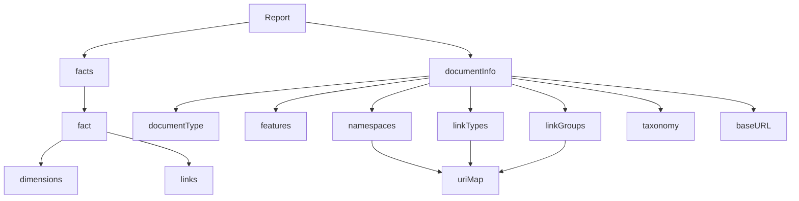

# xbrl-json-processor
Attempting to read and validate XBRL-json files using Node.js and Zod

```mermaid
graph TD;
    Report-->facts;
    Report-->documentInfo;
    documentInfo-->documentType;
    documentInfo-->features;
    documentInfo-->namespaces-->uriMap;
    documentInfo-->linkTypes-->uriMap;
    documentInfo-->linkGroups-->uriMap;
    documentInfo-->taxonomy;
    documentInfo-->baseURL;
    facts-->fact;
    fact-->dimensions;
    fact-->links;
    
    
```